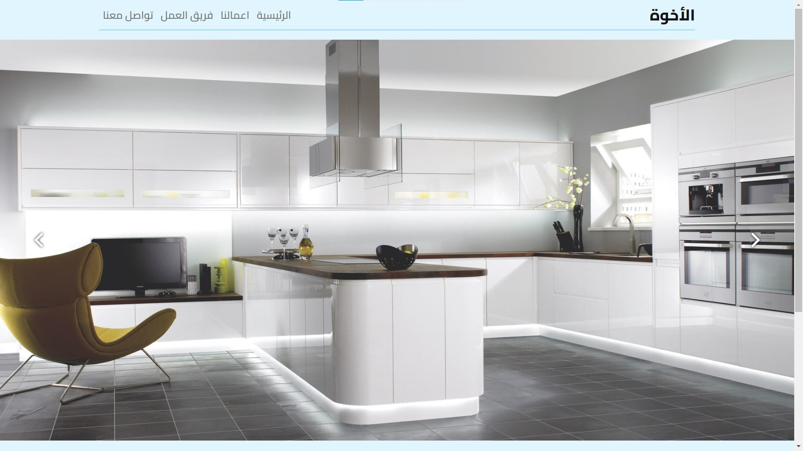

# Elekwoa

### A project I created for a man who owns an aluminum workshop

- The goal of the project is to display this man’s work as a photo gallery

- Another goal is quick communication via email or via direct links by clicking

- The program has a home page, a business page, a communication page, and a work team page

Projects can be added by entering them on the login page

